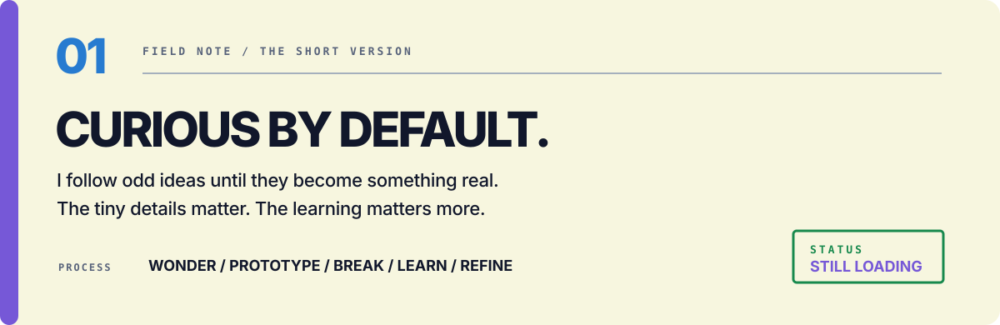
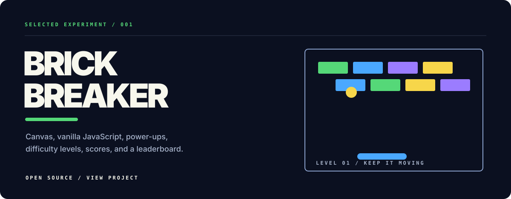
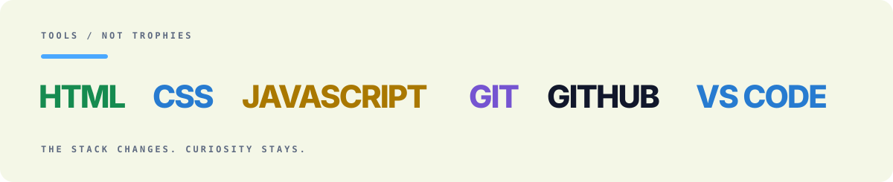

  

  <a href="https://github.com/Eeshitha-afk?tab=repositories">REPOSITORIES</a>
  &nbsp;&nbsp;•&nbsp;&nbsp;
  <a href="https://github.com/Eeshitha-afk/brick-breaker">BRICK BREAKER</a>
  &nbsp;&nbsp;•&nbsp;&nbsp;
  <a href="#the-signal">THE SIGNAL</a>

 

 

 

 

## The signal

<picture>
  <source media="(prefers-color-scheme: dark)" srcset="https://raw.githubusercontent.com/Eeshitha-afk/Eeshitha-afk/output/github-contribution-grid-snake-dark.svg" />
  <source media="(prefers-color-scheme: light)" srcset="https://raw.githubusercontent.com/Eeshitha-afk/Eeshitha-afk/output/github-contribution-grid-snake.svg" />
  
</picture>

 

  <strong>MAKE IT WORK. MAKE IT CLEAR. MAKE IT DELIGHTFUL.</strong>

  <a href="https://github.com/Eeshitha-afk">github.com/Eeshitha-afk</a>

